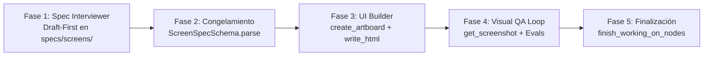

# Workflow: /create-screen

Este workflow orquesta el ciclo de vida completo de creación de una pantalla UI en **Paper**.

---

## Fases del Pipeline

### Fase 1: Entrevista y Borrador Tipado (`spec-interviewer`)
1. El usuario solicita una pantalla (ej. "Diseña el flujo de checkout móvil").
2. El agente genera inmediatamente un archivo `specs/screens/<nombre>.spec.ts` con estado `draft`.
3. Se señalan las dudas clave con `// TODO: Confirmar con usuario: [...]`.
4. El agente pregunta solo por los puntos marcados.

### Fase 2: Congelamiento del Contrato
1. Una vez resueltas las dudas, se actualiza el archivo con `status: "frozen"`.
2. Se ejecuta la validación de contrato para certificar que cumple `ScreenSpecSchema`.

### Fase 3: Renderizado en el Canvas (`ui-builder`)
1. **Pre-tool check**: El guardrail `pre-tool-check.ts` valida el marcado HTML antes de llamar a Paper.
2. **Snapshot inicial**: Se guarda el estado del canvas en `.debug/snapshots/<ts>_before.json`.
3. **Creación**:
   - `create_artboard` con el ancho y alto del viewport especificado.
   - `write_html` por grupos visuales cohesivos (header, formulario, botones).
   - Uso de `flexShrink: 0` en slots y contenedores hijos.
4. **Snapshot final**: Se guarda `.debug/snapshots/<ts>_after.json`.

### Fase 4: Ciclo Evaluador-Optimizador (`visual-qa`)
1. Se captura la vista con `get_screenshot`.
2. Se ejecutan las pruebas deterministas (`typography.eval.ts`, `overflow.eval.ts`, `tokens.eval.ts`).
3. Si el puntaje es menor a 9.5:
   - Se inyectan micro-ajustes con `update_styles`.
   - Se re-evalúa hasta alcanzar $\ge 9.5$ (máximo 3 iteraciones).

### Fase 5: Consolidación
1. Invocación obligatoria de `finish_working_on_nodes`.
2. Entrega del resultado visual y confirmación de la pantalla creada.
