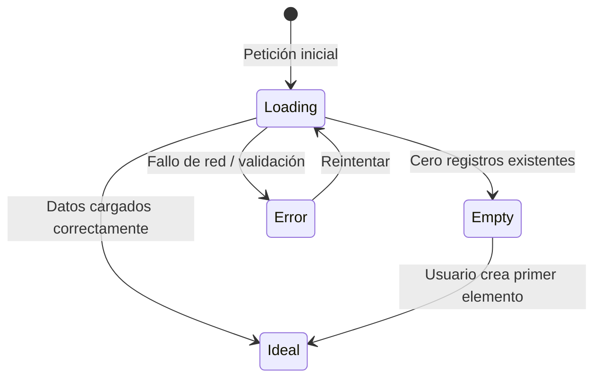

# Cobertura de Estados de Interfaz (State Coverage)

Una pantalla no está completa si solo se diseña el "camino feliz" (*happy path*). Toda interfaz con datos dinámicos debe contemplar y diseñar los siguientes 4 estados:

---

## Los 4 Estados Obligatorios de Pantalla

### 1. Estado Ideal / Poblado (*Ideal State*)
- La vista estándar con datos reales, jerarquía clara y espaciado proporcional.
- Evitar textos de relleno absurdos tipo "Lorem Ipsum dolor"; usar datos de dominio verosímiles.

### 2. Estado Vacío (*Empty State*)
- Se presenta cuando un usuario recién inicia sesión o no tiene registros aún.
- **Estructura obligatoria**:
  1. Ilustración o icono sutil centrado.
  2. Título claro (ej: *"Aún no tienes proyectos creados"*).
  3. Descripción breve indicando el beneficio de crear uno.
  4. Botón de acción principal directo (ej: *"Crear mi primer proyecto"*).

### 3. Estado de Carga (*Loading / Skeleton State*)
- Muestra bloques translúcidos o placeholders que imitan la forma exacta de los componentes finales.
- Ayuda a evitar saltos de layout (*Cumulative Layout Shift - CLS*).

### 4. Estado de Error y Recuperación (*Error State*)
- Ocurre ante fallos de conexión o errores del servidor.
- **Estructura obligatoria**:
  1. Indicador visual comprensible (no códigos de error HTTP crudos).
  2. Explicación humana de lo sucedido.
  3. Acción de recuperación inmediata (*"Reintentar conexión"* o *"Volver al inicio"*).
