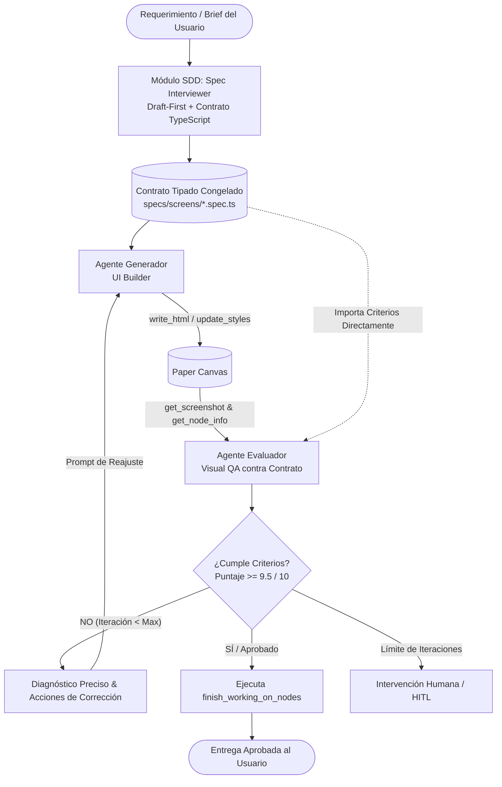
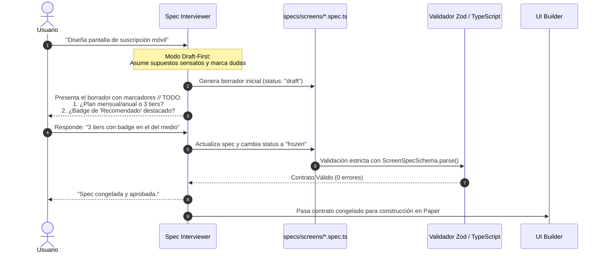
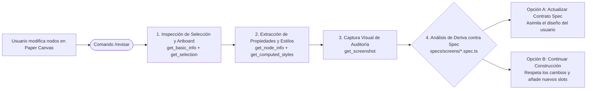
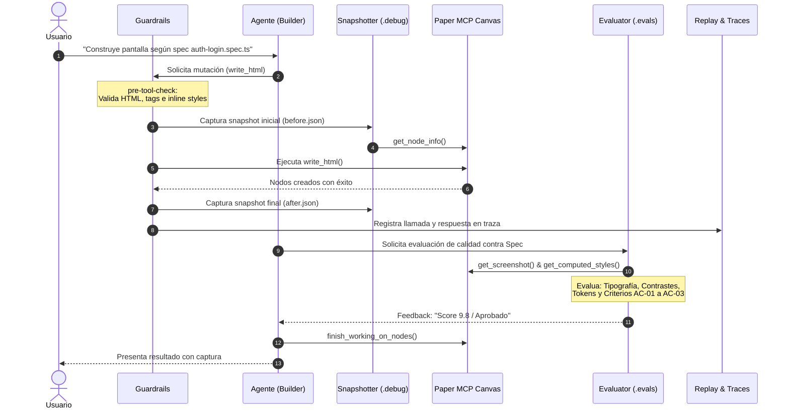
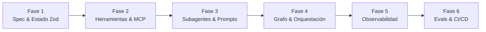

# Especificación Técnica: Sistema Agéntico Autónomo para Paper.Design

Esta especificación detalla la arquitectura, gobernanza, estructura de directorios, motores de depuración, el módulo de **Spec-Driven Development (SDD)** y la guía paso a paso para el diseño e implementación de un **sistema agéntico multi-agente de alta precisión** integrado con **Paper MCP**.

---

## 1. El Patrón Arquitectónico: Generador – Evaluador (*Evaluator-Optimizer Loop*)

El patrón **Generador – Evaluador** (posicionado como el estándar **#2** en la industria para tareas críticas) abandona la presunción de que un LLM puede generar resultados perfectos en un solo intento (*zero-shot*). En su lugar, establece un ciclo iterativo cerrado de mejora continua gobernado por una especificación formal y criterios deterministas/visuales.



### 1.1. ¿En qué consiste?
1. **Generación**: Un agente especialista (*UI Builder*) recibe la especificación formal y ejecuta mutaciones en el canvas (`write_html`, `duplicate_nodes`, `update_styles`).
2. **Evaluación Aislada**: Un agente auditor independiente (*Visual QA*), libre del sesgo de creación, inspecciona el resultado utilizando herramientas de lectura (`get_screenshot`, `get_node_info`, `get_computed_styles`).
3. **Auditoría Multi-Criterio**: El evaluador audita contra una matriz rigurosa:
   - **Reglas Tipográficas**: Cumplimiento de fuentes del sistema, uso estricto de `px` para `font-size`/`line-height` y `em` para `letter-spacing`.
   - **Desbordes y Layout**: Detección de clipping de texto o elementos truncados (exigiendo `height: "fit-content"`).
   - **Alineación y Flex**: Comprobación de slots con `flexShrink: 0` en filas repetidas.
   - **Accesibilidad y Contraste**: Ratios de contraste WCAG AA/AAA.
   - **Adherencia al Contrato**: Verificación estricta de componentes y tokens declarados en la spec.
4. **Ciclo de Corrección (*Feedback Loop*)**: Si no supera el umbral (e.g., $\text{Score} < 9.5/10$), el evaluador genera un reporte de fallos accionable con coordenadas o propiedades exactas a corregir. El generador ejecuta solo los ajustes necesarios sin destruir el resto del trabajo.

### 1.2. Casos de Uso Críticos
- **Diseño de Interfaces Digitales (UI/UX)**: Detección y corrección automática de artefactos visuales, jerarquías rotas y espaciados inconsistentes.
- **Generación de Código Seguro**: Compilación, análisis estático (SAST) y ejecución de suites de pruebas automáticas (TDD).
- **Redacción Jurídica y Técnica**: Validación contra cláusulas estándar, citaciones y normativas vigentes.

---

## 2. Estructura de Directorios Production-Grade

La estructura organiza el conocimiento, las especificaciones formales, la ejecución, la seguridad y la telemetría en capas completamente desacopladas:

```text
Paper.Design/
│
├── .agents/                          # DEFINICIÓN DE INTELIGENCIA Y ROLES
│   ├── subagents/                    # Definiciones declarativas de agentes (prompts y toolsets)
│   │   ├── spec-interviewer.json     # Entrevistador Draft-First y redactor de contratos tipados
│   │   ├── design-architect.json     # Estratega de brief, tokens y paletas
│   │   ├── ui-builder.json           # Constructor de marcado HTML para Paper
│   │   ├── visual-qa.json            # Auditor crítico visual y de accesibilidad contra spec
│   │   └── code-exporter.json        # Extractor de componentes JSX/CSS de producción
│   ├── skills/                       # Procedimientos y runbooks operativos reusables
│   │   ├── revisar/SKILL.md          # Workflow de inspección de cambios manuales y sincronización (/revisar)
│   │   ├── create-screen/SKILL.md    # Workflow completo de creación de pantalla
│   │   ├── sync-tokens/SKILL.md      # Workflow de importación/exportación de tokens
│   │   └── audit-screen/SKILL.md     # Workflow de evaluación de artboards existentes
│   └── rules/                        # Reglas contextuales de ejecución
│       └── paper-canvas.md           # Reglas de manipulación de nodos en Paper
│
├── specs/                            # MÓDULO SPEC-DRIVEN DEVELOPMENT (SSOT)
│   ├── schemas/                      # Esquemas Zod y tipos TypeScript del contrato
│   │   └── screen.schema.ts          # Contrato de pantalla: viewport, tokens, slots, acceptance criteria
│   ├── templates/                    # Plantillas Draft-First con marcadores // TODO
│   │   └── screen.template.ts        # Plantilla inicial generada por el entrevistador
│   ├── screens/                      # Especificaciones reales instanciadas
│   │   ├── auth-login.spec.ts        # Contrato tipado de login (status: "frozen")
│   │   └── user-profile.spec.ts      # Contrato tipado de perfil
│   └── drift/                        # Reportes de deriva canvas vs spec tras /revisar
│       └── 2026-09-27_drift_report.json
│
├── .observability/                   # 1. TELEMETRÍA Y TRAZABILIDAD
│   ├── traces/                       # Trazas completas (prompts, tool calls con I/O exacto)
│   ├── logs/                         # Registro de eventos, advertencias y fallos del ciclo de vida
│   └── metrics/                      # Métricas de consumo: tokens entrada/salida, latencias y costes
│
├── .debug/                           # 2. DEPURACIÓN, REVERSIÓN Y FIXTURES
│   ├── snapshots/                    # Copias JSON del árbol de nodos antes y después de cada mutación
│   │   ├── 2026-09-27_login_before.json
│   │   └── 2026-09-27_login_after.json
│   ├── replays/                      # Grabaciones secuenciales de sesión para reproducir errores
│   └── fixtures/                     # Respuestas mockeadas de Paper MCP para testing sin conexión
│
├── evals/                            # 3. EVALUACIONES Y BENCHMARKS (TESTING DETERMINISTA)
│   ├── golden-screens/               # Capturas visuales aprobadas (línea base de comparación visual)
│   ├── tests/                        # Suites de pruebas automáticas para agentes
│   │   ├── typography.eval.ts        # Comprobación de unidades (px/em) y familias tipográficas
│   │   ├── overflow.eval.ts          # Detección de clipping y ajuste dinámico a fit-content
│   │   └── tokens.eval.ts            # Verificación de adherencia a la paleta oficial
│   └── test-briefs/                  # Casos de prueba sintéticos con requisitos borde
│
├── guardrails/                       # 4. POLÍTICAS Y MIDDLEWARE DE SEGURIDAD
│   ├── pre-tool-check.ts             # Validación y sanitización de HTML antes de write_html
│   ├── post-tool-check.ts            # Verificación de renderizado correcto en Paper
│   └── loop-detector.ts              # Detección de acciones redundantes y prevención de bucles infinitos
│
├── design-system/                    # 5. FUENTE DE VERDAD VISUAL
│   ├── tokens/                       # Tokens serializados
│   │   ├── colors.json               # Paleta primitiva y tokens semánticos
│   │   ├── typography.json           # Escalas tipográficas, pesos y fuentes admitidas
│   │   └── spacing.json              # Escala de espaciados (4px, 8px, 16px, 24px, etc.)
│   └── guidelines/                   # Documentación de diseño y patrones de componentes
│       └── components.md
│
├── briefs/                           # Requerimientos en lenguaje natural (entradas preliminares)
├── exports/                          # Componentes generados para desarrollo (salidas)
│   ├── components/                   # Archivos TSX/React con estilos exactos
│   └── assets/                       # SVGs e imágenes exportadas
│
├── GEMINI.md                         # Protocolo de cumplimiento obligatorio del proyecto
└── README.md                         # Manual de operaciones del workspace
```

---

## 3. Módulo de Spec-Driven Development (SDD)

El módulo SDD garantiza que ningún agente mutador (*UI Builder*) toque el canvas de Paper sin una especificación formal pre-validada por el compilador y congelada por el usuario.



### 3.1. Patrón: Interactive Spec Interviewer en Modo Draft-First (Opción B)
En lugar de interrogar al usuario con preguntas abstractas antes de mostrar nada, el agente:
1. **Formula una propuesta inicial inmediata**: Lee los tokens existentes en `design-system/tokens/` y construye una spec en TypeScript con defaults razonables (viewport estándar de iPhone 15 `390x844`, espaciado `16px/24px`, componentes comunes).
2. **Aislamiento de Incertidumbres**: Marca explícitamente los campos ambiguos con comentarios `// TODO: Confirmar con usuario: [pregunta precisa]`.
3. **Presentación de Diferencias**: Muestra el bloque de código o las decisiones al usuario y pregunta únicamente sobre los puntos marcados.
4. **Congelamiento Inmutable**: Tras el visto bueno, cambia `status: "frozen"`. Desde ese momento, la spec no puede ser alterada por ningún agente durante la fase de construcción.

### 3.2. Patrón: Contract-as-Code con Zod + TypeScript (Opción 1)
La especificación se define en TypeScript y se valida en tiempo de ejecución con **Zod**. Esto ofrece una ventaja dual:
* **En desarrollo**: Autocompletado completo de tipos en el IDE y chequeo estático (`tsc`).
* **En ejecución agéntica**: `ScreenSpecSchema.parse()` detiene al agente al instante si olvida un campo obligatorio, si define dimensiones absurdas o si utiliza tokens inexistentes.

#### Esquema Zod Maestro (`specs/schemas/screen.schema.ts`):
```typescript
import { z } from "zod";

export const ViewportSchema = z.object({
  width: z.number().int().min(320).max(3840),
  height: z.number().int().min(480).max(5000),
  device: z.string().min(1),
  orientation: z.enum(["portrait", "landscape"]).default("portrait"),
});

export const ComponentNodeSchema = z.object({
  id: z.string().regex(/^[a-z0-9-]+$/, "El ID debe ser kebab-case"),
  role: z.enum(["container", "header", "form", "button", "card", "list-item", "slot"]),
  label: z.string().optional(),
  flexShrink: z.number().min(0).max(1).default(0),
  height: z.union([z.number(), z.literal("fit-content")]).default("fit-content"),
  tokens: z.object({
    background: z.string().optional(),
    color: z.string().optional(),
    border: z.string().optional(),
  }).optional(),
  children: z.array(z.lazy(() => ComponentNodeSchema)).optional(),
});

export const AcceptanceCriterionSchema = z.object({
  id: z.string().regex(/^AC-\d{2,}$/),
  description: z.string().min(5),
  type: z.enum(["layout", "typography", "accessibility", "token", "interaction"]),
});

export const ScreenSpecSchema = z.object({
  id: z.string().min(3),
  version: z.string().default("1.0.0"),
  status: z.enum(["draft", "in-review", "frozen"]),
  metadata: z.object({
    title: z.string(),
    description: z.string(),
    author: z.string(),
    createdAt: z.string(),
  }),
  viewport: ViewportSchema,
  components: z.array(ComponentNodeSchema).min(1),
  acceptanceCriteria: z.array(AcceptanceCriterionSchema).min(1),
});

export type ScreenSpec = z.infer<typeof ScreenSpecSchema>;
export type ComponentNode = z.infer<typeof ComponentNodeSchema>;
export type AcceptanceCriterion = z.infer<typeof AcceptanceCriterionSchema>;
```

#### Ejemplo de Contrato Instanciado (`specs/screens/auth-login.spec.ts`):
```typescript
import { ScreenSpec, ScreenSpecSchema } from "../schemas/screen.schema";

export const authLoginSpec: ScreenSpec = ScreenSpecSchema.parse({
  id: "screen-auth-login",
  version: "1.0.0",
  status: "frozen",
  metadata: {
    title: "Inicio de Sesión Móvil",
    description: "Flujo principal de acceso con email, password y autenticación social",
    author: "User + Spec Interviewer",
    createdAt: "2026-09-27T23:20:00Z",
  },
  viewport: {
    width: 390,
    height: 844,
    device: "iPhone 15",
    orientation: "portrait",
  },
  components: [
    {
      id: "brand-header",
      role: "header",
      height: "fit-content",
      flexShrink: 0,
      label: "Logotipo y bienvenida",
    },
    {
      id: "credentials-form",
      role: "form",
      height: "fit-content",
      flexShrink: 0,
      children: [
        { id: "email-field", role: "slot", label: "Campo de correo electrónico" },
        { id: "password-field", role: "slot", label: "Campo de contraseña" },
      ],
    },
    {
      id: "primary-login-button",
      role: "button",
      height: 48,
      flexShrink: 0,
      label: "Iniciar Sesión",
      tokens: {
        background: "colors.primary.default",
        color: "colors.text.inverse",
      },
    },
  ],
  acceptanceCriteria: [
    {
      id: "AC-01",
      description: "El botón de login debe tener altura fija de 48px para tap target mínimo WCAG.",
      type: "accessibility",
    },
    {
      id: "AC-02",
      description: "Los contenedores y slots deben utilizar flexShrink: 0 para evitar desalineaciones.",
      type: "layout",
    },
    {
      id: "AC-03",
      description: "Todos los textos deben utilizar tipografía en 'px' y la familia Inter.",
      type: "typography",
    },
  ],
});
```

### 3.3. Sincronización Bidireccional y Detección de Deriva: El Comando `/revisar`

En el diseño de interfaces en equipo, el usuario con frecuencia ajusta espaciados, mueve capas o añade elementos directamente en el lienzo de Paper. Para evitar que el agente sobreescriba estos cambios o trabaje sobre una versión desfasada, el sistema incorpora el comando y skill `/revisar`:



#### Flujo Operativo de `/revisar`:
1. **Detección de Foco (`get_basic_info`, `get_selection`)**: Si el usuario seleccionó un grupo de nodos o un artboard en Paper, el comando centra el análisis exclusivamente en ese contexto. Si no hay selección, evalúa el artboard activo.
2. **Auditoría Estructural y Estilos Exactos**: Recupera los estilos calculados reales (`get_computed_styles`) y la jerarquía (`get_node_info`), detectando si el usuario introdujo nuevos colores, fuentes o dimensiones.
3. **Reporte de Deriva (*Drift Analysis*)**: Compara el lienzo con la spec activa en `specs/screens/*.spec.ts`. Si hay diferencias, genera un registro en `specs/drift/` y le presenta al usuario un informe conciso sin IDs crudos.
4. **Sincronización**: El usuario decide si el contrato en TypeScript debe actualizarse para adoptar su nuevo diseño como nueva fuente de verdad, o si el agente debe construir las siguientes piezas respetando lo que el usuario editó.

---

## 4. Funcionamiento de los 4 Motores de Depuración y Gobernanza



### 4.1. El Snapshotter (`.debug/snapshots/`)
* **Mecanismo Operativo**: Antes de cualquier mutación destructiva o creación de nodos (`write_html`, `update_styles`, `delete_nodes`), el sistema ejecuta `get_node_info` o `get_children` del contenedor afectado y genera un volcado JSON timestamped (`<timestamp>_<action>_before.json`). Inmediatamente tras la ejecución, guarda `<timestamp>_<action>_after.json`.
* **Beneficio Técnico**:
  - Proporciona un mecanismo de **reversión instantánea (*rollback*)**: si un agente rompe una jerarquía compleja, un script de rollback puede reescribir las propiedades previas exactas mediante `update_styles` sin perder el trabajo del lienzo.
  - Permite calcular **diffs semánticos de árbol de nodos** en formato JSON para auditar qué atributos cambiaron exactamente.

### 4.2. El Replay Harness (`.debug/replays/`)
* **Mecanismo Operativo**: Registra de forma determinista la tupla estructurada:
  $$\mathcal{T} = \langle \text{Prompt}, \text{Context}, \text{Thinking}, \text{ToolCall}(\text{Name}, \text{Args}), \text{ToolResponse} \rangle$$
* **Beneficio Técnico**:
  - Si un modelo falla en un caso borde (por ejemplo, calcula mal el layout de una grilla compleja), la sesión se puede re-ejecutar en un arnés de pruebas aislado (*offline*) usando los fixtures grabados.
  - Permite hacer *prompt engineering* experimental: modificar el system prompt y verificar si el nuevo prompt produce la llamada a herramienta correcta sin tener que recrear manualmente el estado del canvas.

### 4.3. Las Evals Visuales y Semánticas (`evals/`)
La calidad no se evalúa a ojo humano; se valida mediante dos baterías de pruebas automatizadas:
* **Evals Semánticas (TypeScript / Assertions)**:
  - *Typography Assertions*: Valida que ningún nodo tenga `font-size` con unidades porcentuales o relativas (`rem`, `vh`), exigiendo estrictamente `px`, y que `font-family` pertenezca a la lista autorizada en `get_basic_info`.
  - *Token Adherence*: Valida que los colores hexadecimales coincidan con los tokens de `design-system/tokens/colors.json`.
  - *Contract Verification*: Valida que los componentes especificados en `spec.components` existan con los IDs y dimensiones requeridas.
  - *Session Integrity*: Valida que toda sesión de modificación concluya invariablemente con la invocación de `finish_working_on_nodes`.
* **Evals Visuales (Pixelmatch & Computer Vision)**:
  - Captura una imagen con `get_screenshot`.
  - Ejecuta un diff de píxeles contra la captura de referencia en `golden-screens/`.
  - Mide automáticamente el ratio de contraste WCAG (mínimo 4.5:1 para texto normal, 3:1 para texto grande o elementos interactivos).

### 4.4. Guardrails (Intercepción en Tiempo Real / Middleware)
Los guardrails operan como un **proxy / firewall de red** ubicado entre el razonamiento del LLM y el conector MCP de Paper:
* **Pre-tool Guardrail (`pre-tool-check.ts`)**:
  - Parsea el HTML de `write_html` antes de enviarlo a Paper.
  - Detecta tags no soportados por el motor de Paper (ej. `<script>`, `<iframe>`, `<style>`).
  - Bloquea la inyección de atributos no estándar o IDs duplicados.
* **Post-tool Guardrail (`post-tool-check.ts`)**:
  - Verifica si el nodo insertado generó desbordamiento fuera de los límites de su artboard padre. Si hay clipping vertical, inyecta automáticamente una corrección con `update_styles(height: "fit-content")`.
* **Loop Detector (`loop-detector.ts`)**:
  - Mantiene un buffer circular con los hashes de las últimas 5 llamadas a herramientas. Si detecta una repetición idéntica o un ciclo oscilatorio ($A \to B \to A \to B$), interrumpe la ejecución del agente, eleva una alerta e inyecta un cambio de estrategia en el contexto.

---

## 5. Guía de Ingeniería: Cómo Construir un Sistema Agéntico Paso a Paso

Para construir un sistema agéntico robusto desde cero, se sigue una metodología de 6 fases secuenciales:



### Fase 1: Diseñar el Esquema de Estado y Contratos Tipados
Define un contrato de datos estricto con Zod y TypeScript (`specs/schemas/screen.schema.ts`). Ningún agente trabaja sobre requerimientos en prosa sin que antes se compile y congele una spec tipada.

### Fase 2: Wrappers de Herramientas con Menor Privilegio
Aísla las herramientas de acuerdo a la responsabilidad de cada rol:
* **Entrevistador**: Solo interactúa con el usuario y escribe archivos de spec en disco.
* **Lectura**: Solo para inspectores y evaluadores (`get_screenshot`, `get_node_info`, `get_tokens`).
* **Mutación**: Exclusivo para constructores (`create_artboard`, `write_html`, `update_styles`).
* **Ciclo de Vida**: Exclusivo para el supervisor (`finish_working_on_nodes`).

### Fase 3: Especificación de Roles y Prompts de Especialistas
Cada subagente debe contar con rol conciso, entradas obligatorias (la spec congelada), restricciones inquebrantables y formato de salida estructurado.

### Fase 4: Implementación del Grafo de Control y Handoffs
Modela el flujo de control como una máquina de estados determinista:
- **Transición Condicional**:
  $$\text{Si } \text{QA\_Score} \ge 9.5 \implies \text{Handoff to CodeExporter}$$
  $$\text{Si } \text{QA\_Score} < 9.5 \text{ and } \text{Iterations} < 3 \implies \text{Handoff to UIBuilder with Feedback}$$
  $$\text{Si } \text{Iterations} \ge 3 \implies \text{Escalate to Human Supervisor}$$

### Fase 5: Cableado de Telemetría y Observabilidad
Todo evento de LLM debe emitir un registro estructurado a `.observability/traces/` registrando `traceId`, `spanId`, modelo, latencia y conteo de tokens.

### Fase 6: Pruebas de Regresión y Quality Gates
Integra las pruebas automáticas de la carpeta `evals/tests/` como barreras de calidad previas a la aprobación de cualquier pantalla o exportación a código.

---

> [!TIP] Recomendación de Gobernanza
> El entrevistador de especificaciones nunca debe tener acceso a herramientas de mutación de Paper (`write_html`). Su único entregable es el archivo TypeScript validado y congelado en `specs/screens/`. Separar la especificación de la construcción es el secreto para eliminar la deriva de requisitos.
